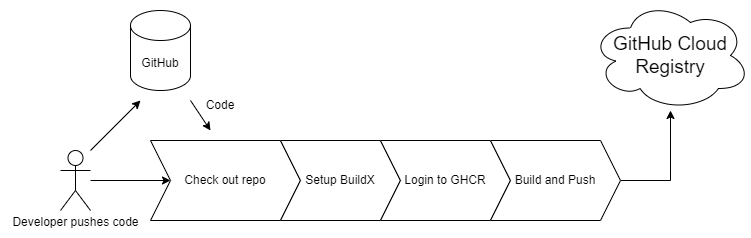

This tutorial investigates how to use GitHub Actions to build a docker image and publish it into a GitHub container registry where it can then be downloaded onto servers and set into production. The tutorial will cover how to build the project as a docker image, how to setup the registry and how to deploy the image to the registry.

Elements of the tutorial:

- Containerization of an application
- Setting up a GitHub action for CD
- Publishing the container to the GitHub registry: https://github.com/features/packages

### Relevance

While cloud providers such as Google Cloud Platform, AWS, Azure etc provide great value, they come at a cost. Both in terms of the financials of running infrastructure on them but also in terms of security and privacy. Self-hosted continuous deployment is an option, but the setup can be complicated. The most important steps are the containerization of the application and integration of continuous delivery to a container registry, like the GitHub container registry.
