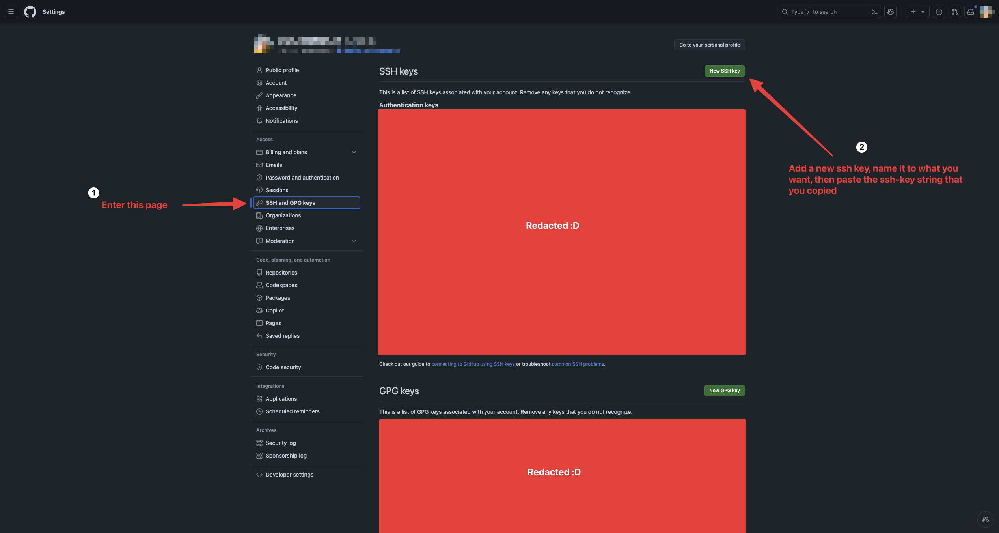

# Creating a git repository

## SSH keys

Now since you're not logged in to your GitHub account, you will be required to create and copy the .ssh keypair from the folder root/.ssh/id_rsa.pub to your GitHub account. This way we get push access to the repository.

First, to generate the keys run the following command (and proceed by just pressing enter):
If/when it asks you to overwrite the file, just press `y` and then `enter`. You don't need a passphrase for this key.

```bash
ssh-keygen
```

Now run:

```bash
cat /root/.ssh/id_rsa.pub
```

Great! This is now your public key, copy it and paste it into github, follow the images below:



