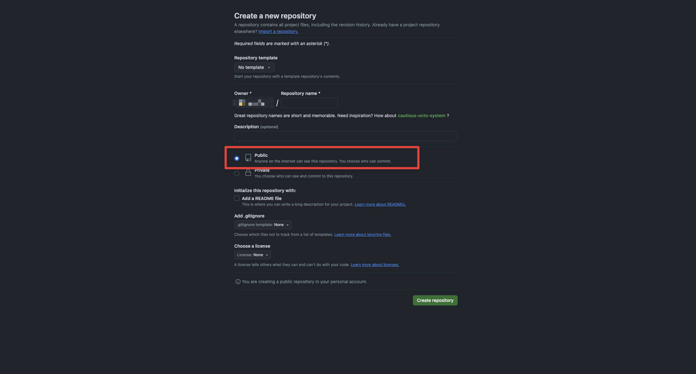

# Creating a git repository

## Github

Now that we have a working application inside our container let's continue. Before we can upload it, we first need to create a GitHub repository ([here](https://github.com/new)). GitHub has a so called container store where you can upload your container images. This is called [ghcr.io](https://ghcr.io). But before we can upload anything to here, we first need to create a repository, make sure to make it `Public`, this is very important for the script to be able to check the registry.



To link this properly you need to do the following:

Within the `server` folder initialize a git repository by running the following command:

```bash
git init
```

Lastly make sure to set an alias email and name for the git repository by running the following commands:

```bash
git config --global user.name "Sven Svensson"
git config --global user.email "example@mail.se"
```
