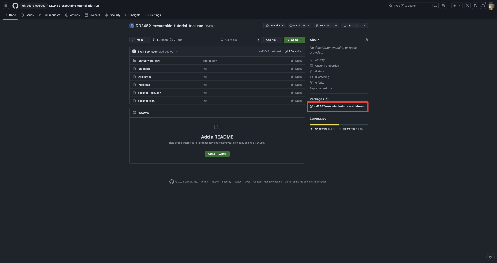
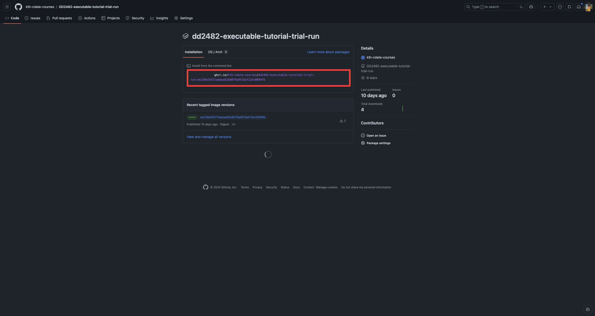

# Setup Github Actions

Now, add and commit this change to your repository. Push these changes to GitHub. Doing this should trigger the GitHub action which adds the container to the GitHub Container Registry [GHCR].

Example:  
We have a mock repository setup for this: https://github.com/kth-cdate-courses/DD2482-executable-tutorial-trial-run  
Entering this repository you'll find the package to the right. Click on the package and copy the container URL, the container URL is only the part after ghcr.io. In our case the url is: `ghcr.io/kth-cdate-courses/dd2482-executable-tutorial-trial-run:ee238e55571adeea82b8079a9516af12ec0099fb`

In order to check your progress, we will attempt to pull your distribution using Docker. Create a file `URL.txt` in the folder above `server`. Copy the URL to your container in GHCR into URL.txt and press validate. Note that both the repository and distribution should be public in order for the validation to succeed.
